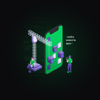

# Application 📦

> Application API

<p>
  

  

  
</p>

The intention behind this repository is to always maintain a viable and simple Guard to use in any type of `NodeJS Framework`



## Installation

You can install this project using;

```bash
git clone https://github.com/secjs/applicationapi
```

```bash
cd application
cp .env.example .env
```

```bash
yarn
```

## Documentation

For API Documentation you can use [Insomnia]('https://insomnia.rest/download/') and import our [Workspace]('https://github.com/secjs/applicationapi/blob/master/.github/insomnia.json') inside of it.

Check our Workspace file [clicking in here]('https://github.com/secjs/applicationapi/blob/master/.github/insomnia.json')
